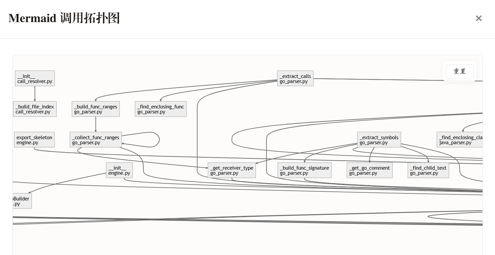
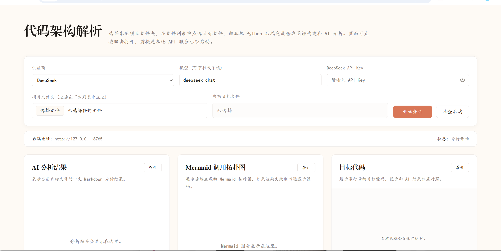

# CodeToPo

CodeToPo is a local code structure analysis tool. Select a project folder and a target source file, then the backend builds a cross-file call graph and uses an LLM to generate a focused explanation for that file.





The Mermaid graph is interactive: click a node to highlight the selected node and its directly related upstream and downstream calls. Click the blank area to clear the highlight.

## English

### Features

- Select a local project folder and choose a target file from the file list
- Build cross-file call relationships with Tree-sitter based parsing
- Generate a Mermaid call topology graph
- Show the target source code with line numbers
- Generate Markdown analysis for the selected file with an LLM
- Support multiple model providers:
  - DeepSeek
  - OpenAI
  - Kimi
  - Anthropic
  - GLM
  - MiniMax
  - OpenAI-Compatible

### Supported Languages

- Python `.py`
- Java `.java`
- Go `.go`
- C `.c`
- C Header `.h`

### Quick Start

Clone the repository:

```bash
git clone https://github.com/mrclngs/CodeToPo.git
cd CodeToPo
```

Create a virtual environment and install dependencies:

```powershell
python -m venv .venv
.\.venv\Scripts\pip.exe install -r .\requirements.txt
```

Start the local backend:

```powershell
.\.venv\Scripts\python.exe .\local_api.py
```

Or use the batch script:

```powershell
.\start_local_api.bat
```

Then open:

[http://127.0.0.1:8765/](http://127.0.0.1:8765/)

### Usage

1. Start the local backend.
2. Open the browser page.
3. Choose a model provider and enter your API key.
4. Select a local project folder.
5. Click the target file in the file list.
6. Click `开始分析`.

The page returns:

- AI analysis result
- Mermaid call graph
- Numbered target source code

### Interactive Graph

- Click a graph node to highlight the selected node and its directly related calls
- Click the blank area in the graph to clear the current highlight
- Use the reset button to clear selection and fit the graph back into view

### Project Structure

```text
.
├─ frontend/              # Browser frontend
├─ core/                  # Analysis service, call graph, and core logic
├─ languages/             # Tree-sitter language parsers
├─ tests/                 # Unit tests
├─ docs/images/           # README screenshots
├─ local_api.py           # Local HTTP API entrypoint
├─ requirements.txt       # Python dependencies
└─ start_local_api.bat    # Windows startup script
```

### Requirements

- Python 3.11 or newer
- A valid API key for your selected model provider

### Test

```powershell
python -m unittest discover -s tests -q
```

### Notes

- The backend listens on `http://127.0.0.1:8765` by default
- `OpenAI-Compatible` requires a custom `Base URL`
- Tree-sitter is used for static parsing, and the LLM is used for explanation generation
- `.venv`, cache folders, and editor settings should not be committed

## 中文

### 项目说明

CodeToPo 是一个本地运行的代码结构分析工具。你选择项目目录和目标源码文件后，后端会构建跨文件调用图，并结合大模型生成针对目标文件的分析说明。

上面的 Mermaid 图支持交互：点击节点会高亮当前节点以及和它直接相关的上下游调用关系，点击空白区域可以取消高亮。

### 功能

- 选择本地项目目录，并从文件列表中点选目标文件
- 基于 Tree-sitter 构建跨文件调用关系
- 生成 Mermaid 调用拓扑图
- 展示带行号的目标源码
- 调用大模型生成目标文件的 Markdown 分析结果
- 支持多种模型提供商：
  - DeepSeek
  - OpenAI
  - Kimi
  - Anthropic
  - GLM
  - MiniMax
  - OpenAI-Compatible

### 支持语言

- Python `.py`
- Java `.java`
- Go `.go`
- C `.c`
- C 头文件 `.h`

### 快速开始

先克隆仓库：

```bash
git clone https://github.com/mrclngs/CodeToPo.git
cd CodeToPo
```

创建虚拟环境并安装依赖：

```powershell
python -m venv .venv
.\.venv\Scripts\pip.exe install -r .\requirements.txt
```

启动本地后端：

```powershell
.\.venv\Scripts\python.exe .\local_api.py
```

或者使用批处理脚本：

```powershell
.\start_local_api.bat
```

启动后在浏览器打开：

[http://127.0.0.1:8765/](http://127.0.0.1:8765/)

### 使用方法

1. 启动本地后端
2. 打开浏览器页面
3. 选择模型提供商并填写 API Key
4. 选择本地项目文件夹
5. 在文件列表中点击要分析的目标文件
6. 点击 `开始分析`

页面会返回：

- AI 分析结果
- Mermaid 调用图
- 带行号的目标源码

### 图交互

- 点击图节点，会高亮当前节点及其直接相关调用
- 点击图中的空白区域，可以清除当前高亮
- 点击重置按钮，会清除选择并重新适配视图

### 项目结构

```text
.
├─ frontend/              # 浏览器前端
├─ core/                  # 分析服务、调用图和核心逻辑
├─ languages/             # Tree-sitter 语言解析器
├─ tests/                 # 单元测试
├─ docs/images/           # README 截图
├─ local_api.py           # 本地 HTTP API 入口
├─ requirements.txt       # Python 依赖
└─ start_local_api.bat    # Windows 启动脚本
```

### 环境要求

- Python 3.11 或更高版本
- 可用的模型 API Key

### 测试

```powershell
python -m unittest discover -s tests -q
```

### 说明

- 后端默认监听 `http://127.0.0.1:8765`
- 使用 `OpenAI-Compatible` 时需要手动填写 `Base URL`
- 项目使用 Tree-sitter 做静态解析，使用大模型生成解释性分析
- `.venv`、缓存目录和编辑器配置不建议提交到仓库

## License

MIT
